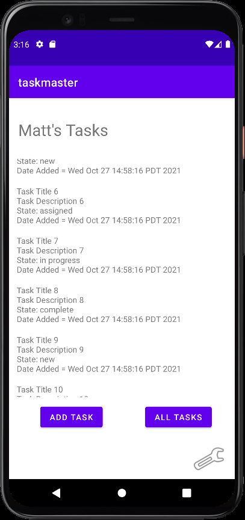
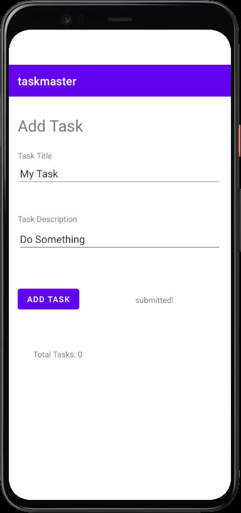
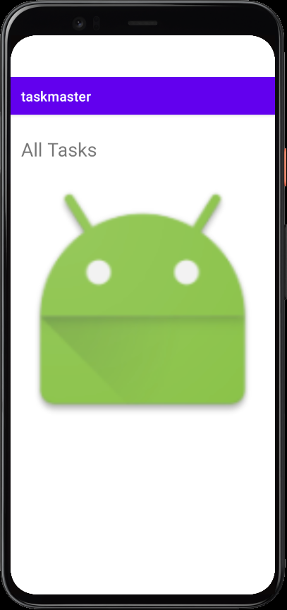
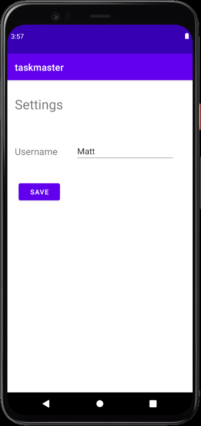

# taskmaster

## Description
A simple task managing app built for Android Studio practice. The app contains 3 pages:
    - Homepage
    - Add Task - This page includes a simple form for a task/description and submit button.
    - All Tasks - Page to display all tasks.

## Changelog

### [1.0.0] - 2021-10-25
### Added
- `Homepage` with 2 buttons that redirect to `Add Task` and `All Tasks` pages.
- `Add Task` page with a simple form for task title/description and a submit button.
- Submit button will display a "submitted!" message.
- `All Tasks` page, currently no functions, just displays an image.

### [1.0.1] - 2021-10-26
### Added
- `TaskDetail` activity that displays the title and description of the task.
- `Settings` activity that allows the user to save a username which is reflected on the `Homepage`.

### Changed
- `Homepage` now has 3 hardcoded tasks with a button that takes it to a `TaskDetail` page.
- `Homepage` also has a wrench icon that takes the user to the settings page.

### [1.0.2] - 2021-10-27
### Added
- Implemented a `RecyclerView` to render a task list on the homepage
- Created a fragment and `ViewAdapter` to support the `RecyclerView`.
- `Task` model which takes in a title, description, state, and date.

### Changed
- Homepage now displays a hardcoded list which implements a `RecyclerView`.
- Clicking on a task in the list takes you to the `TaskDetail` page with the appropriate title.

### Removed
- Hardcoded list and buttons on the homepage.

### Screenshots

