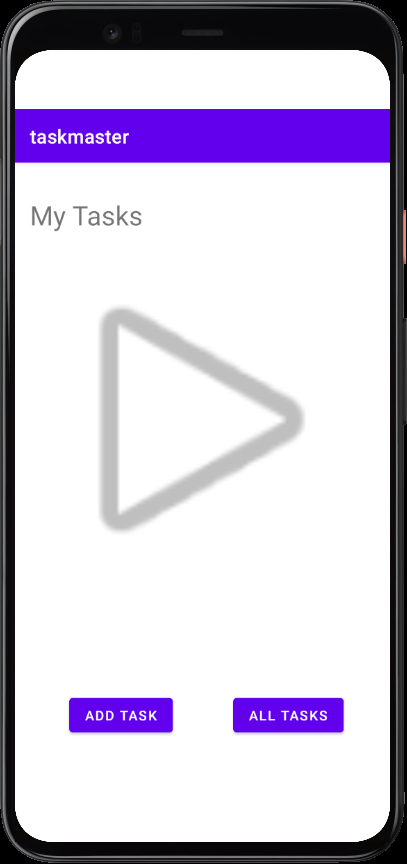

# taskmaster

## Description
A simple task managing app built for Android Studio practice. The app contains 3 pages:
    - Homepage
    - Add Task - This page includes a simple form for a task/description and submit button.
    - All Tasks - Page to display all tasks.

## Changelog

### [1.0.0] - 2021-10-25
### Added
- `Homepage` with 2 buttons that redirect to `Add Task` and `All Tasks` pages.
- `Add Task` page with a simple form for task title/description and a submit button.
- Submit button will display a "submitted!" message.
- `All Tasks` page, currently no functions, just displays an image.

### Screenshots

